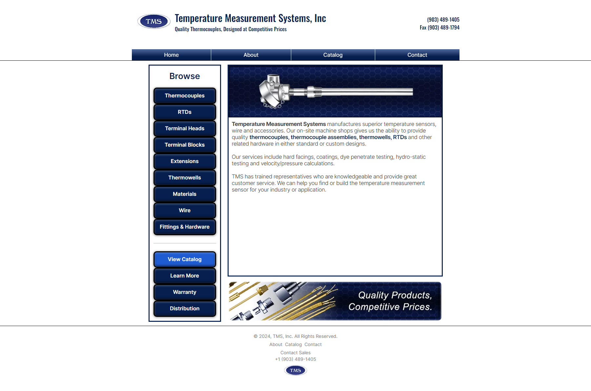
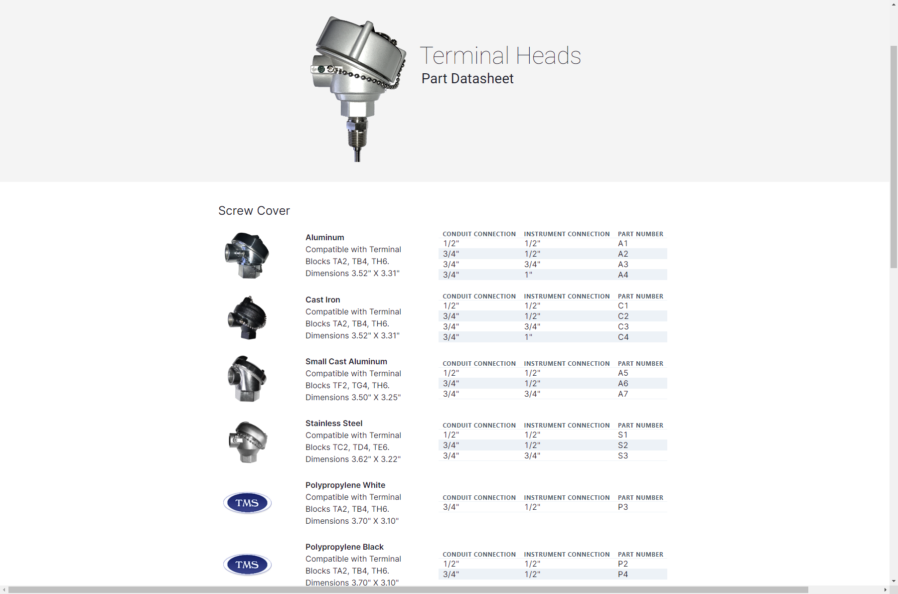
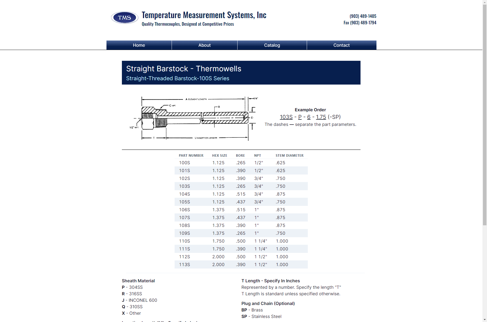

## Temperature Measurement Systems, Inc.

### Public Statement and Terms of Use

This repository serves as a public documentation platform for content related to Temperature Measurement Systems, 
including the showcase of technology utilized on the company's website. All assets not governed by public licensing 
are proprietary assets created by and exclusively used by Temperature Measurement Systems are protected by 
copyright and may be subject to legal action in case of unauthorized use or abuse.

Users accessing this repository are advised to adhere to any applicable licensing terms associated with the content 
provided herein. Any unauthorized use or reproduction of proprietary assets belonging to 
Temperature Measurement Systems is strictly prohibited and may result in legal action.

Distribution of these proprietary assets for non-commercial purposes is permitted, provided proper 
attribution to Temperature Measurement Systems is given. It is explicitly prohibited to use these assets in 
commercial applications, including but not limited to products, services, or advertisements, without express written 
permission from Temperature Measurement Systems. The distribution must not be for commercial gain or profit in 
any form. The distributed assets must not be modified or altered in any way that could misrepresent or damage the 
reputation of Temperature Measurement Systems. 

Temperature Measurement Systems reserves the right to revoke permission 
for any distribution at any time and for any reason, without prior notice.

Copyright © 2024 Temperature Measurement Systems. All rights reserved.

### About

This is a website created for Temperature Measurement Systems, Inc. a temperature sensor manufacturer based in 
Malakoff, Texas.

It contains information pertaining to TMS and instructions for creating the part codes used in TMS quotes and 
manufacturing.

Any information on the site is subject to be changed.

### Tools Used

You can find all the tools used in this project as they are all publicly available.

* [Next.js](https://nextjs.org/)
* [TypeScript](https://www.typescriptlang.org/)
* [Tailwind CSS](https://tailwindcss.com/)
* [Chakra UI](https://chakra-ui.com/)

### Questions?

If you have any questions regarding the development of this site, or how to get in touch with the person who made it.

You can contact them at their personal email at - **seth.mgma@gmail.com**

If you have any questions regarding the business

You can contact the sales team for Temperature Measurement Systems at - **sales@tms80.com**

### Pictures

